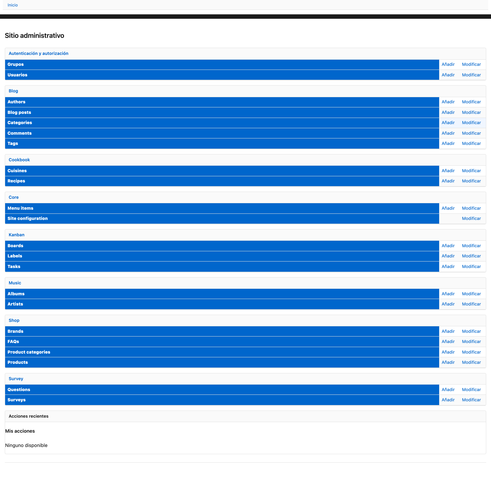
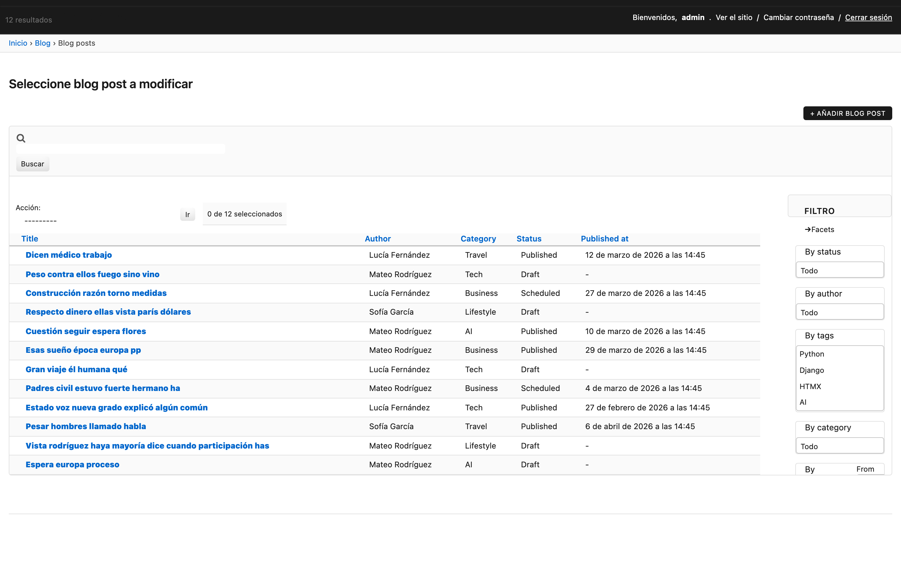

# django-yp-admin

**Un tema impulsado por htmx + helpers para `django.contrib.admin`. Dos dependencias. Cero jQuery.**

`django-yp-admin` es un **tema de admin impulsado por htmx más un pequeño conjunto de helpers** para `django.contrib.admin`. Incluye sobrescrituras de templates (Picnic CSS, widgets HTML5 nativos, htmx) y modelos abstractos y mixins de admin reutilizables (OrderedModel, SingletonModel, historial liviano, widgets htmx). Se monta sobre el `AdminSite` estándar; **no** es un reemplazo completo.

!!! note "v0.1"
    105 tests sobre Python 3.11–3.14 × Django 4.2 / 5.2 / 6.0. Subclases personalizadas de `AdminSite` y paquetes de admin de terceros (**django-cms**, **wagtail**, **allauth**, **django-guardian**, **django-polymorphic**, **django-reversion**, **django-import-export** de extremo a extremo) **todavía no están validados**. Consulta [Compatibilidad](compatibility.md).

## Vista previa



Changelist con barra lateral de filtros, filtros de rango, multi-select:



## Lo que obtienes

- **Tema impulsado por htmx.** Sobrescrituras de templates para changelist, formulario de cambio y login. Base con Picnic CSS, tematizable mediante propiedades CSS personalizadas. Modo oscuro vía `prefers-color-scheme`.
- **Sin jQuery.** ~62KB gzip de JS total en lugar de ~250KB.
- **Dos dependencias obligatorias.** Django + `django-htmx`. Extras opcionales cuando los necesites.
- **HTML5 nativo.** `<input type="date">`, `<dialog>`, `<details>` en lugar de widgets de jQuery.
- **Helpers (opt-in).** `OrderedModel`, `SingletonModel`, historial liviano, filtros con htmx, autocompletado con htmx + Tom Select, inlines anidados/ordenables nativos en htmx.

## Instalación

```bash
pip install django-yp-admin
```

## Inicio rápido

```python
INSTALLED_APPS = [
    "django_yp_admin",   # before django.contrib.admin
    "django.contrib.admin",
    "django_htmx",
    # ...
]
```

Abre `/admin/`. Los admins estándar siguen funcionando con el nuevo tema. Para activar filtros y widgets nativos de htmx por modelo, cambia la clase base de tu `ModelAdmin` a `django_yp_admin.options.ModelAdmin`.

## Próximos pasos

- [Instalación](installation.md)
- [Inicio rápido](quickstart.md)
- [Referencia de ModelAdmin](modeladmin.md)
- [Filtros](filters.md)
- [Singletons](singleton.md)
- [Modelos ordenados](ordered.md)
- [Versionado](versioning.md)
- [Extras opcionales](optional-extras.md)
- [Soporte de navegadores](browser-support.md)
- [Compatibilidad](compatibility.md)
