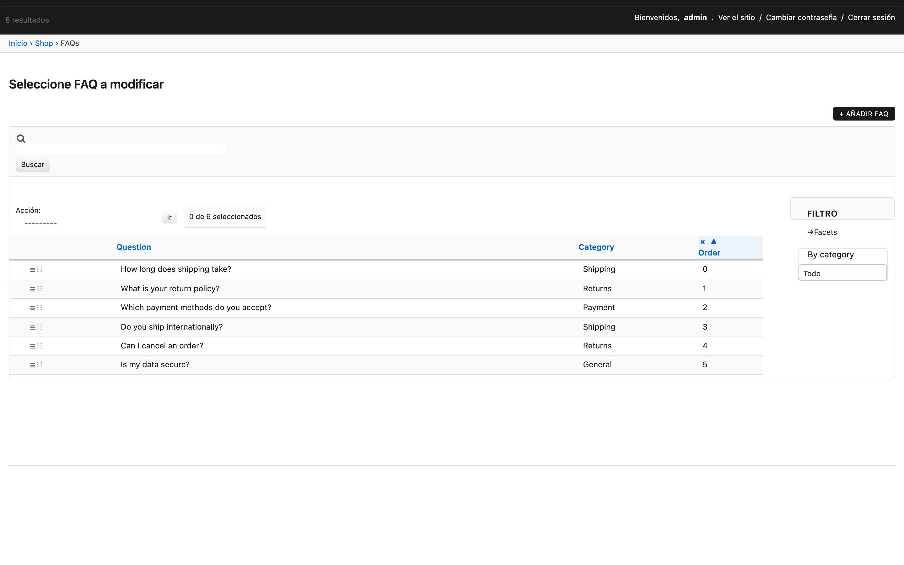

# Modelos ordenados

Reemplaza a `django-ordered-model`. `move_to(n)` atómico e inlines con HTML5 Drag & Drop, ~120 LOC.



## Modelo

```python
from django.db import models
from django_yp_admin.models import OrderedModel


class Album(models.Model):
    name = models.CharField(max_length=100)


class Track(OrderedModel):
    title = models.CharField(max_length=100)
    album = models.ForeignKey(Album, on_delete=models.CASCADE, related_name="tracks")
    order_with_respect_to = "album"  # separate sequences per album

    class Meta(OrderedModel.Meta):
        constraints = [
            models.UniqueConstraint(
                fields=["album", "order"],
                name="track_album_order_uniq",
            )
        ]
```

`order_with_respect_to` acepta un string (una FK) o una tupla de strings (agrupación multi-clave).

## Concurrencia: declara un UniqueConstraint

`move_to()` usa `select_for_update()`, pero un `UniqueConstraint` a nivel de base de datos sobre los campos de `order_with_respect_to` más `order` es **obligatorio** para evitar que dos transacciones concurrentes produzcan filas con orden duplicado. Las subclases DEBEN declararlo ellas mismas — `OrderedModel` es abstracto y el conjunto de campos depende de cada subclase.

Para modelos sin `order_with_respect_to`, restringe `["order"]` por sí solo o marca el campo `order` con `unique=True`.

## API

- `instance.order` — la posición actual. Se asigna automáticamente al `save()` si falta.
- `instance.move_to(n)` — desplaza atómicamente esta fila a la posición `n`. Las filas hermanas en `(old, new]` (o `[new, old)`) se desplazan en ±1 con un solo `UPDATE … SET order = order + 1` bajo `select_for_update()`.

```python
last = Track.objects.filter(album=album).last()
last.move_to(0)  # promote to first
```

## Drag & Drop en el admin

```python
from django_yp_admin.contrib.ordered_admin import OrderedAdmin
from django_yp_admin.options import TabularInline


class TrackInline(TabularInline):
    model = Track
    sortable_field = "order"   # enables HTML5 DnD + htmx reorder endpoint


@admin.register(Album)
class AlbumAdmin(ModelAdmin):
    inlines = [TrackInline]
```

Sin jQuery UI. El reordenamiento llega al endpoint `views/reorder.py` vía htmx y las filas se intercambian visualmente de inmediato.
