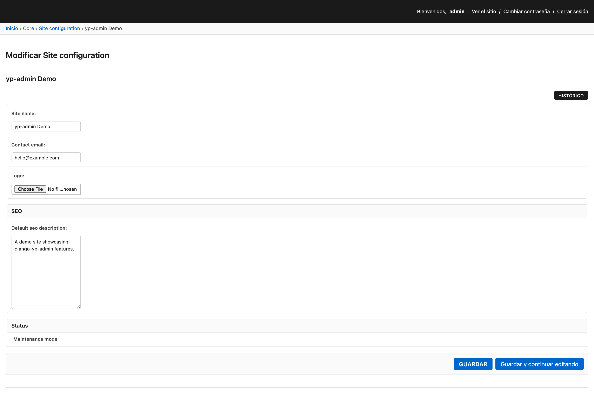

# Modelos singleton

Substitui o `django-solo`. ~120 LOC, sem dependência adicional.



## Modelo

`django_yp_admin.models.SingletonModel` é uma base abstrata que fixa `pk=1` ao salvar e transforma `delete()` em uma operação nula.

```python
from django.db import models
from django_yp_admin.models import SingletonModel


class SiteConfig(SingletonModel):
    site_name = models.CharField(max_length=100, default="My Site")
    primary_color = models.CharField(max_length=7, default="#000000")

    def __str__(self):
        return self.site_name
```

## Acesso

```python
config = SiteConfig.get_solo()
config.site_name = "New Name"
config.save()  # still pk=1
```

`get_solo()` é equivalente a `get_or_create(pk=1)` e é idempotente.

## Admin

Use o admin ciente de singleton para redirecionar as URLs de "add" e "changelist" para a única instância:

```python
from django_yp_admin.contrib.solo_admin import SingletonModelAdmin


@admin.register(SiteConfig)
class SiteConfigAdmin(SingletonModelAdmin):
    pass
```

## Migrando do django-solo

`SingletonModel` tem a mesma semântica de `pk=1`. Remova a dependência `django-solo`, troque o caminho do import, não rode migrações (os dados são idênticos).
